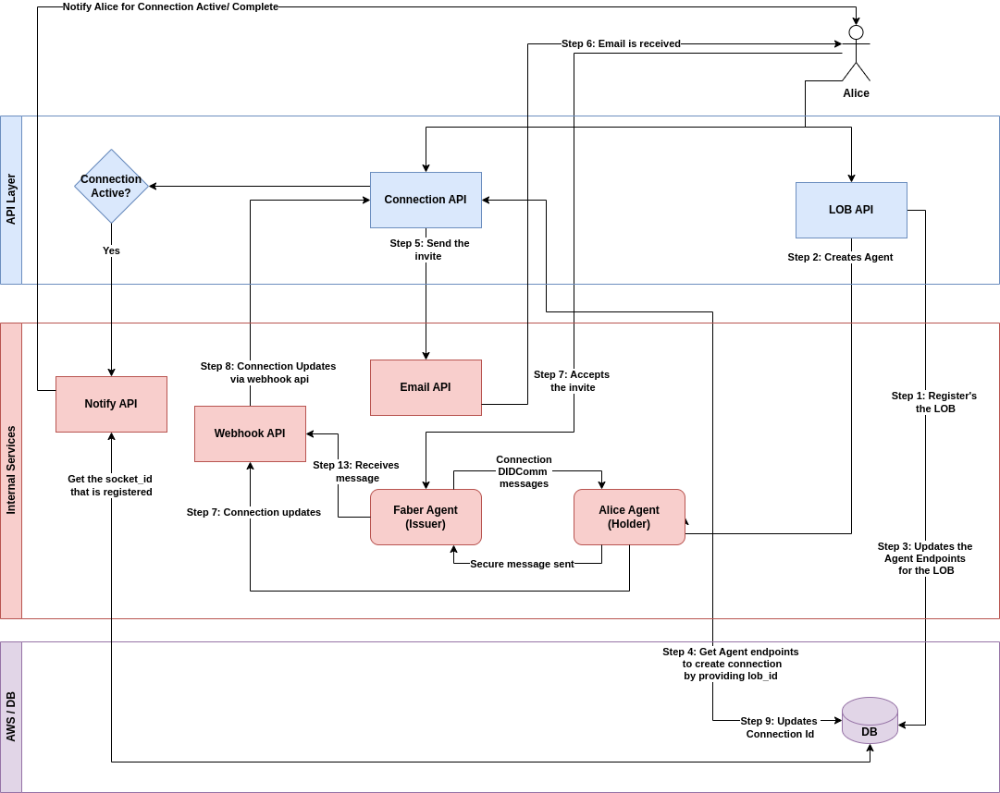

# Connection API

Northern Block has created a Connection API as part of the Orbit Enterprise API solution. The Connection API will connect with peer entities using either out-of-band (OOB) invitations or DID Exchange. The Connection API is applicable only where both parties support DIDComm AIP 2.0 protocol.

The Connection API, upon receiving the confirmation of an accepted connection invitation, creates a Contact.&#x20;

Out-of-band connection invitations can be sent in the following ways:

1. Via URL through email, SMS, or any type of message your LOB prefers
2. Via URL that is posted on the LOB's website or some other location that invites people to scan
3. Via email that the API will send on the LOB's behalf

In the case of Out-of-band -based invitations to connect, the peer can be either a mobile wallet or cloud wallet.&#x20;

In the case of DID Exchange-based connections, the peer must have a public DID.

There must be a stated exchange protocol for each contact. This protocol can either be retrieved from the public DID of the contact, if available, or else the LOB must provide the protocol. If the protocol is not provided, the Connection API will default the protocol to AIP 2.0 at this time.

States of the Connection Invitation are listed below:

1. For invitation sent: Draft, Sent, Accepted
2. For invitation received: Received, Accepted\

<figure><figcaption></figcaption></figure>

&#x20;&#x20;
