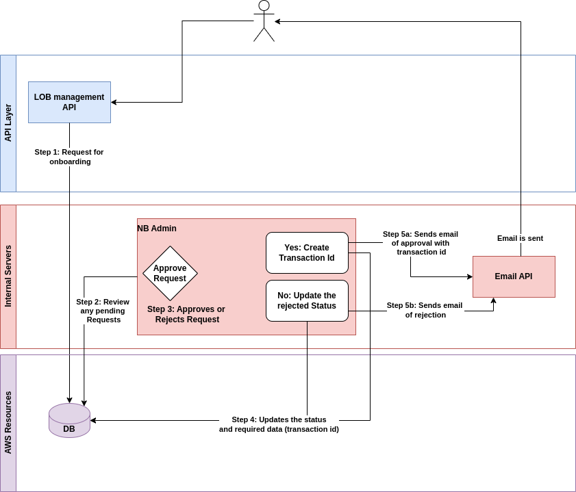

# LOB API

The LOB, or Line of Business, is the organization that will be using the Orbit Enterprise APIs to issue and verify digital credentials. Northern Block will issue an admin API key that will be used for registering the LOB.&#x20;

Once the LOB is registered, the API will provide an API key, as well as the LOB ID, that will be included in all of the Enterprise API transactions. During the LOB onboarding process, the agents will be started and the LOB settings will be recorded. The LOB ID will tie all of the applicable transactions back to the appropriate organization.&#x20;

Should the need arise for a new API key, one can be issued to a specific LOB at any time by submitting that request to Northern Block via email at info@northernblock.io. \
\
You will find an overview of the LOB API steps below, with additional details provided in the following pages.

#### Registering Your LOB 

1. Registration request initiated.
2. A Northern Block Admin will review and approve / reject the registration request.
3. The status of the LOB request is updated.
4. If the LOB is approved, an API key is sent to the LOB Requestor via email.

<figure><figcaption>
Registering Your LOB
</figcaption></figure>

#### Creating Your LOB 

1. The LOB Requestor calls the LOB Create API using the provided API key.
2. Agent for the LOB is started.
3. Upon a successful API call, the LOB ID will be sent via email.

<figure><figcaption>
Creating Your LOB
</figcaption></figure>

