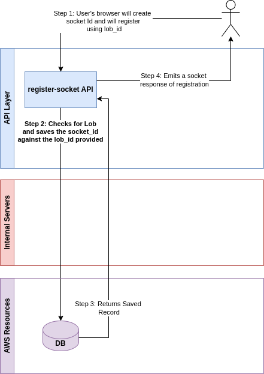

# RegisterSocket API

The RegisterSocket API is used to register the LOB's front-end application with SocketID so that the Orbit Enterprise API can inform the front-end application of events that may be of interest.

The LOB can have multiple open client sessions. The client session may or may not register Socket ID. When the RegisterSocket API is called, it will register the Socket ID for the LOB's front-end application. Since the LOB's front-end application can have multiple open client sessions, multiple sockets can be registered.

The socket registration can be terminated by the LOB front-end application or it will be deleted when the front-end application session ends.

<figure><figcaption></figcaption></figure>

\
