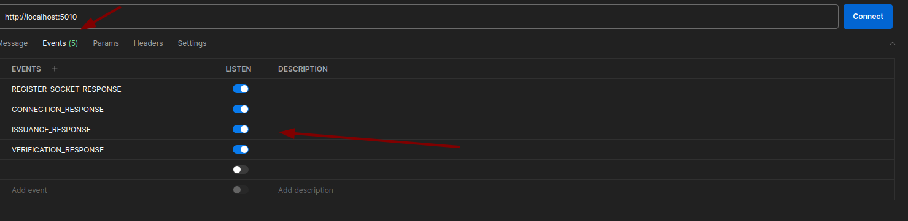

# Setup Sockets In Postman

### Follow the steps below to setup a socket connection using Postman.

#### Step 1:

Click on "New Collection"

<figure><figcaption></figcaption></figure>

#### Step 2:

Select socket.io

<figure><figcaption></figcaption></figure>

#### Step 3:

Add the EAPI Socket base URL in the address bar and hit the _Connect_ button.

<figure><figcaption></figcaption></figure>

#### Step 4:

In the _Message_ section, add the `lobID`.

<figure><figcaption></figcaption></figure>

#### Step 5:

Select the event as _REGISTER\_SOCKET_.

<figure><figcaption></figcaption></figure>

#### Step 6:

Go to the _Events_ tab and ensure that all socket events are enabled to receive events from the server. Make sure the _Event Listen_ toggle is turned on.

1. REGISTER\_SOCKET\_RESPONSE
2. CONNECTION\_RESPONSE
3. ISSUANCE\_RESPONSE
4. VERIFICATION\_RESPONSE

<figure><figcaption></figcaption></figure>

#### Step 7:

Lastly, go to the _Message_ tab, ensure that you have entered the `lobID` as shown in the image below, and hit _Send_. Your lob is now connected with the socket server.

<figure><figcaption></figcaption></figure>

