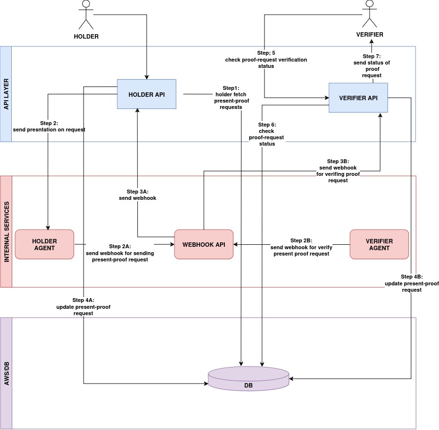

# Verifier API

Northern Block has created a Digital Credential Verification API solution that enables the verification of standards-based digital credentials.

Owners, or holders, of these digital credentials can store their credentials locally in digital identity wallets and present them to any third-party that accepts those types of credentials, removing the need for call-homes to verify the credentials’ authenticity. This offers enormous privacy-preserving benefits for the holders of credentials, while allowing relying parties to digitally transform business processes, since high-integrity data can now be easily consumed.\

<figure><figcaption>
Send Presentation Request
</figcaption></figure>

\
Organizations with business processes that require authentic information from holders can verify credentials as proof. This eliminates the need for verifiers to review and verify data manually entered by holders. After verifying the credential, an organization can then store this data or use it to populate other applications based on the organization’s business processes.&#x20;

<figure><figcaption>
Verify Presentation Request
</figcaption></figure>

Let's do a deep dive now into the Verifier API.\
